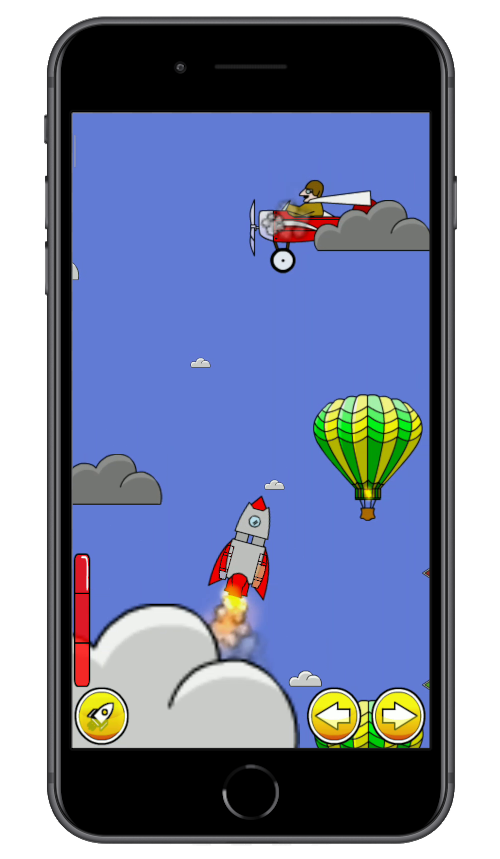
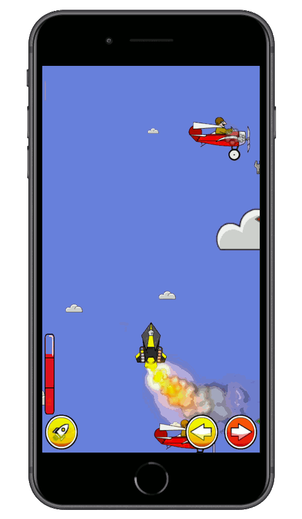
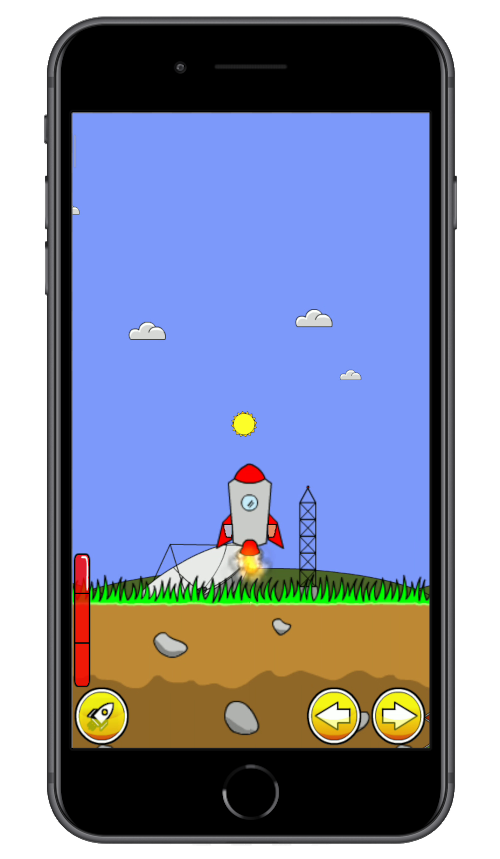
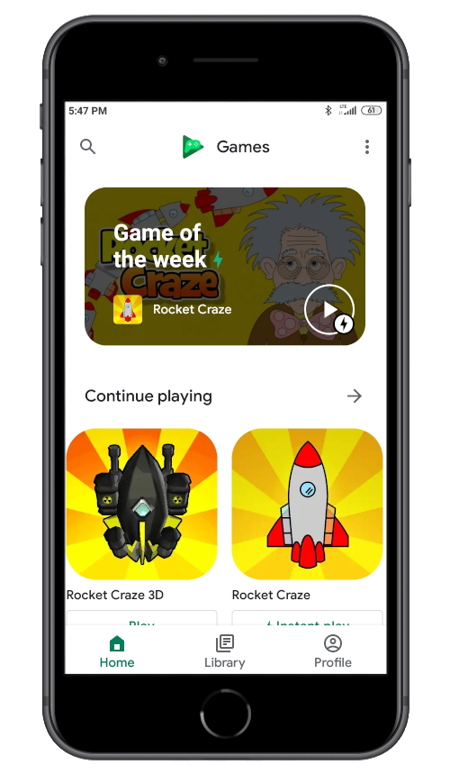
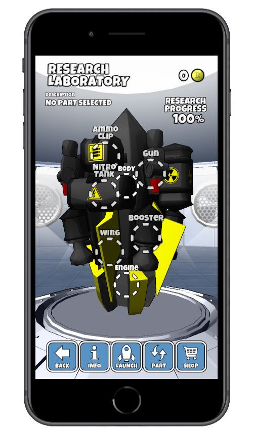
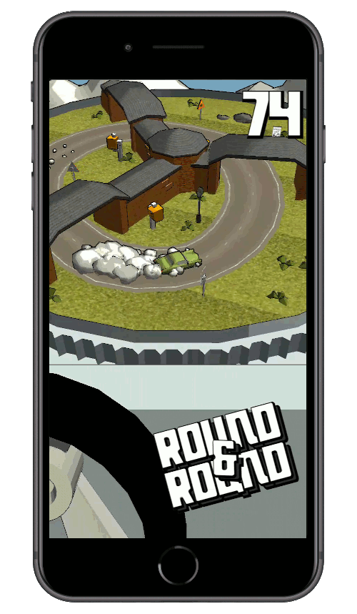
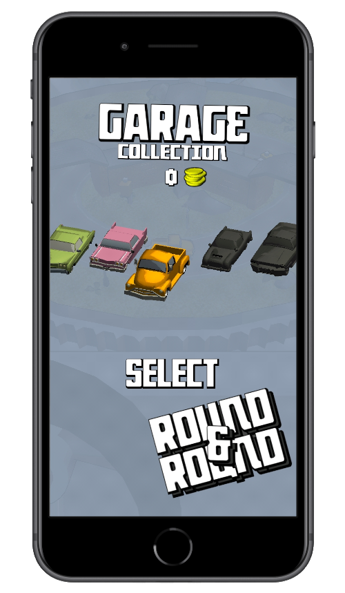

  &nbsp;&nbsp;&nbsp;
  &nbsp;&nbsp;&nbsp;
  &nbsp;&nbsp;&nbsp;
  

## Projects

### Rocket Craze (Android)

**About** 
Arcade based game where the player builds and fly the rocket. The aim of the game is to reach the Moon by successively upgrading rocket's components after each flight. 

**Description** 
Creation of the game involved vast set of skills from different areas of expertise. Every aspect of the game was solely created by me - starting from such a rudimentary elements as physics based movement, spatial partitioning algorithms and shader's rendering and ending up at design of graphical elements, UI behaviour and creation of music. 

Putting it all together was quite a feat involving countless hours of hard work and resulted with over 3 millions players enojoying the game at Google Play Store. It also has been chosen for featuring in an Instant "Game of the week" and "Top 3 instant plays" programs.

**Technologies** 
Android SDK, Android Studio, Java 1.8 (JDK8), OpenGL ES 2.0, GLSL, Google Admob, Billing, Firebase, Play Games Services, Git, GIMP

 

### Rocket Craze 3D (Android, iOS, Windows)

**About** 
The sequel to Rocket Craze engrained in 3d virtual world. The aim of the game, just as in its predecessor, is to reach the Moon with a rocket gradually upgraded by the player after each flight. 

**Description** 
Yet again creating the game of this magnitude involved countless hours of hard work as well as having bloodstream caffeine's level high above its limits. Beside of the usual work related with software engineering, in this case C#, the project required from me having an understanding of 3d space and math involved as well as modelling, texturing and above all enlivening all that data using gaming technology's standards such as Unity and Luxology Modo.

The game, just as well its predecessor, was positively received by the gaming community and resulted in over 300 thousands downloads at Google Play Store.

**Technologies** 
Unity, C#, Cg/HLSL, Visual Studio, MonoDevelop, Google Admob, Billing, Cloud Save, Firebase, Play Games Services, Luxology Modo, Git

  
 

   
  

### World Caps League (Android, iOS)

**About** 
Mini soccer with the bottle caps as a players and two game-play modes: Human vs Human and Human vs CPU.

**Technologies** 
Unity, C#, Visual Studio, MonoDevelop, Google Admob, Firebase, Luxology Modo, Git

  
 

### Round And Round (Android, iOS)

**About** 
Endless type of arcade game where the player has to drive a car round the scene. The scene itself is set on rotating dish which increases in speed each time the player passes through one of the gates. The aim of the game is to gather as many speeding tickets as possible which are admitted when passing through the gates.

**Technologies** 
Unity, C#, Cg/HLSL, Visual Studio, MonoDevelop, Google Admob, Firebase, Play Games Services, Luxology Modo, Git

  
 

